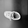
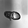

# CS 440/540: Deep Learning - Assignment#1 -- Ahmad Agah

---

## Q2: Single Layer vs Two Layer Network

**Task:** Compare a 1-layer FC network (784→1024→10) with a 2-layer FC network (784→1024→1024→10).

### Experimental Setup

| Parameter | Value |
|-----------|-------|
| Batch Size | 30 |
| Learning Rate | 0.001 |
| Momentum | 0.0 |
| Activation | ReLU |
| Epochs | 20 |
| Optimizer | SGD |
| Loss Function | CrossEntropy |

### Results

| Metric | Single-Layer (784→1024→10) | Two-Layer (784→1024→1024→10) |
|--------|----------------------------|------------------------------|
| Test Accuracy | 84.13% | 84.25% |
| Training Accuracy | 85.62% | 85.87% |
| Final Training Loss | 0.411 | 0.401 |
| Total Parameters | 814,090 | 1,863,690 |

### Training Curves


### Q2(a): Analysis

The two-layer network achieved 84.25% test accuracy compared to 84.13% for the single-layer network, which is a difference of just 0.12%. At first glance, this seems surprising given that the two-layer network has over twice the parameters (1.86M vs 814K). However, looking at the training curves and final metrics, this outcome makes sense when we consider what each network is actually learning.

The single-layer network directly maps the 784 input pixels to 1024 hidden features, then to 10 class outputs. This single transformation must capture all the patterns needed to distinguish classes like "T-shirt" from "Shirt" or "Sneaker" from "Ankle Boot." The two-layer network, in theory, can build hierarchical representations where the first layer might detect edges and textures, while the second layer combines these into higher-level patterns like sleeves or shoe shapes.

So why is the improvement so small? FashionMNIST images are only 28×28 grayscale with relatively simple shapes. The dataset does not have the complexity that would require deep hierarchical feature extraction. A single layer with 1024 neurons already has enough capacity to learn the necessary discriminative patterns. The training curves show both networks converging smoothly with similar loss trajectories, and neither shows signs of underfitting, so the single-layer network is simply sufficient for this task.

The nearly identical gap between training and test accuracy (~1.5%) for both networks indicates that neither is overfitting significantly. Adding depth provides marginal benefit here, but would likely matter more for complex natural images where hierarchical features are essential.

---

## Q3: Hyperparameter Experiments (24 Cases)

**Task:** Using the 2-layer network, experiment with different batch sizes, learning rates, and activation functions.

### Configuration Grid

| Parameter | Values Tested |
|-----------|---------------|
| Batch Size | 1, 10, 1000 |
| Learning Rate | 1.0, 0.1, 0.01, 0.001 |
| Activation | ReLU, Sigmoid |
| **Total Experiments** | 3 × 4 × 2 = **24** |

Fixed parameters: 20 epochs, momentum = 0.0, SGD optimizer, CrossEntropy loss.

### Results Table

| Batch Size | Learning Rate | Activation | Test Accuracy | Status |
|:----------:|:-------------:|:----------:|:-------------:|:------:|
| 1 | 1.0 | ReLU | 10.00% | Failed |
| 1 | 1.0 | Sigmoid | 10.00% | Failed |
| 1 | 0.1 | ReLU | 10.00% | Failed |
| 1 | 0.1 | Sigmoid | 86.71% | |
| 1 | 0.01 | ReLU | 88.80% | |
| 1 | 0.01 | Sigmoid | 88.65% | |
| **1** | **0.001** | **ReLU** | **89.42%** | **BEST** |
| 1 | 0.001 | Sigmoid | 85.79% | |
| 10 | 1.0 | ReLU | 0.00% | Failed |
| 10 | 1.0 | Sigmoid | 87.08% | |
| 10 | 0.1 | ReLU | 88.60% | |
| 10 | 0.1 | Sigmoid | 88.31% | |
| 10 | 0.01 | ReLU | 88.79% | |
| 10 | 0.01 | Sigmoid | 85.52% | |
| 10 | 0.001 | ReLU | 86.76% | |
| 10 | 0.001 | Sigmoid | 77.82% | |
| **1000** | **1.0** | **ReLU** | **0.00%** | **WORST** |
| 1000 | 1.0 | Sigmoid | 83.34% | |
| 1000 | 0.1 | ReLU | 85.98% | |
| 1000 | 0.1 | Sigmoid | 77.23% | |
| 1000 | 0.01 | ReLU | 80.68% | |
| 1000 | 0.01 | Sigmoid | 54.83% | |
| 1000 | 0.001 | ReLU | 67.62% | |
| 1000 | 0.001 | Sigmoid | 49.37% | |

### Summary

- **Best Configuration:** batch_size=1, lr=0.001, ReLU → **89.42%**
- **Worst Configuration:** batch_size=1000, lr=1.0, ReLU → **0.00%**

### Analysis: Best vs Worst Cases

The gap between the best and worst configurations is striking, with 89.42% versus 0.00%. Understanding why requires looking at how batch size, learning rate, and activation function interact during training.

**Why the worst case completely failed:**
The configuration (batch_size=1000, lr=1.0, ReLU) produced NaN losses from the very first epoch, meaning the weights exploded to infinity. Here is what happened: with batch size 1000, each gradient update is computed from a large, stable batch that produces consistent gradients. When multiplied by learning rate 1.0, these gradients cause enormous weight updates. ReLU makes this worse because it has no output ceiling, so if pre-activations become large, ReLU passes them through unchanged, and these large values propagate forward, creating even larger gradients on the next pass. Within a few iterations, the weights overflow to NaN. Notably, the same lr=1.0 with Sigmoid still achieved 83.34% at batch_size=1000, because Sigmoid squashes outputs between 0 and 1, naturally limiting how large activations can grow.

**Why the best case succeeded:**
The configuration (batch_size=1, lr=0.001, ReLU) represents stochastic gradient descent at its most granular. Each training example produces its own gradient update, so over one epoch the network sees 60,000 individual updates rather than 60 batch updates. This has two effects: first, the high variance in gradients acts as implicit regularization, preventing the network from memorizing specific examples. Second, the small learning rate of 0.001 ensures each update is gentle, allowing the network to slowly navigate the loss landscape without overshooting good minima. ReLU outperforms Sigmoid here because at such small learning rates, vanishing gradients become the bigger concern. Sigmoid derivatives are at most 0.25 and shrink toward zero for large inputs, causing gradients to diminish as they propagate backward. ReLU gradients are either 0 or 1, preserving gradient magnitude through the layers.

**Patterns observed across all 24 experiments:**
Smaller batch sizes consistently outperformed larger ones when other parameters were held constant. With batch_size=1, four out of eight configurations exceeded 85% accuracy. With batch_size=1000, only one configuration (lr=0.1, ReLU at 85.98%) crossed 85%. The learning rate and activation function interact: ReLU requires careful learning rate tuning (fails catastrophically at lr≥0.1 with large batches) but excels when tuned correctly. Sigmoid is more forgiving across learning rates but hits a lower accuracy ceiling due to gradient saturation in deeper layers.

---

## Q4: Data Pollution Experiment

**Task:** Train on polluted training data and test on clean test data using the best parameters from Q3.

### Q4(a): Pollution Procedure

For each of the 10 classes in the training set:

1. Randomly selected 9 groups of images, each group containing 1% of that class's images
2. Relabeled each group to one of the other 9 classes
3. This moves 9% of images from each class to wrong labels

**Result:** 5,400 out of 60,000 training labels were corrupted (9% pollution). The test dataset was kept completely clean and unmodified.

### Q4(b): Training Configuration

Used the best parameters identified from Q3:

| Parameter | Value |
|-----------|-------|
| Network | 2 FC layers (784→1024→1024→10) |
| Batch Size | 1 |
| Learning Rate | 0.001 |
| Activation | ReLU |
| Epochs | 20 |

### Q4(c): Results and Explanation

| Training Data | Test Accuracy | Training Accuracy | Final Training Loss |
|---------------|---------------|-------------------|---------------------|
| Clean (baseline) | 88.59% | 94.81% | 0.140 |
| Polluted (9% corrupted) | **88.98%** | 85.84% | 0.555 |

**Difference:** The polluted model performed **0.39% better** on the test set despite being trained on corrupted data.

### Analysis

This result initially seems wrong. How can training on bad data produce better test accuracy? But the numbers tell a clear story when we examine the training dynamics.

The clean model achieved 94.81% training accuracy and 88.59% test accuracy, a gap of 6.22%. This gap indicates overfitting: the network memorized training examples rather than learning features that generalize to unseen data. With batch_size=1 and 20 full passes through 60,000 examples, the network had ample opportunity to fit individual training samples.

The polluted model could only reach 85.84% training accuracy because 9% of the labels were simply wrong, and no amount of learning can correctly classify a "Shirt" image labeled as "Trouser." But this ceiling on training accuracy had an unintended benefit: it prevented memorization. The network could not achieve high training accuracy by fitting individual examples, so it was forced to learn patterns that worked across many samples. These patterns turned out to be more general, transferring better to the clean test set.

The training loss confirms this interpretation. The clean model drove loss down to 0.140, aggressively fitting every training example. The polluted model plateaued at 0.555, unable to fit the noisy labels but also avoiding the overfitting trap. In effect, the label noise acted like a regularizer, similar to techniques like label smoothing or dropout that intentionally add noise to prevent overfitting.

This result has practical implications: real-world datasets often contain labeling errors, and this experiment suggests that moderate noise levels (around 9%) may not significantly harm, and might even help, generalization, particularly when the model has high capacity relative to the task complexity.

---

## Q5: Circular Shift Test

**Task:** Evaluate how the trained 2-layer network handles spatially shifted test images without any retraining.

### Shift Procedure

Starting with the model trained in Q2 (2-layer network, 84.25% original test accuracy):

1. **Right shift by 2 pixels:** For each row in the 28×28 image, move all pixels 2 positions to the right. The rightmost 2 pixels wrap around to become the leftmost 2 pixels.

2. **Down shift by 2 pixels:** Applied to the already right-shifted images. Move all rows down by 2 positions, with the bottom 2 rows wrapping to the top.

```
Original Image:          After Right Shift (2px):
[A B C D ... W X Y Z]    [Y Z A B C D ... W X]

After Right+Down Shift:
(same row transformation, plus rows wrap vertically)
```

### Q5(a): Results and Findings

| Test Data | Accuracy | Change from Original |
|-----------|----------|---------------------|
| Original (no shift) | 84.25% | - |
| Right shift (2 pixels) | 57.17% | **-27.08%** |
| Right + Down shift (2 pixels each) | 47.83% | **-36.42%** |

### Analysis

The accuracy collapse from 84.25% to 57.17% after shifting just 2 pixels to the right is dramatic. Adding the vertical shift drops accuracy further to 47.83%, which is barely better than random guessing for a 10-class problem (10% baseline). This experiment exposes a fundamental limitation of fully-connected networks for image tasks.

A fully-connected network treats each pixel as an independent input feature. When training on FashionMNIST, the network learns that certain pixel positions carry specific information. For example, pixels near position (14, 14) tend to have high values for shoes, or pixels along the edges are typically dark for shirts. These learned associations are tied to exact coordinates in the flattened 784-element input vector.

When we shift the image, every learned association breaks. A shoe that activated neurons because of brightness at positions 380-420 in the input vector now has those same brightness values at positions 382-422. The network has never seen this configuration and interprets it as a completely different pattern. The circular wrap-around makes it worse because pixels from the right edge suddenly appear on the left, creating discontinuities that look nothing like natural images.

The accuracy after both shifts (47.83%) is still above 10% random chance, suggesting the network retains some ability to recognize overall patterns like "this looks more like clothing than accessories." But fine-grained classification is destroyed because the spatial relationships the network memorized no longer apply.

This result explains why convolutional neural networks dominate image classification. CNNs use the same filter weights across all spatial positions, so a vertical edge detector works whether that edge appears on the left or right of the image. Pooling layers further reduce sensitivity to exact positions by summarizing features over local regions. A 2-pixel shift would barely affect a CNN's predictions, but it devastates our fully-connected network.

For any real-world application where objects might appear at different positions within the frame, fully-connected networks are fundamentally unsuitable without extensive data augmentation that includes shifted versions of training images.

---

## Q6: Real Photo Classification (Bonus)

**Task:** Use the trained 2-layer network to classify a real photograph of a garment.

### Input Image

- **Source:** Photograph of a Nike sneaker taken with an iPhone camera
- **Original dimensions:** 5712 × 4284 pixels
- **Target format:** 28×28 grayscale (matching FashionMNIST)

### Q6(a): Handling the Size Difference

The original photo is roughly 200× larger than FashionMNIST images in each dimension. Direct downsampling from 5712×4284 to 28×28 would lose almost all detail, so careful preprocessing was essential:

1. **Resizing:** Used Lanczos resampling, which applies a high-quality filter to preserve edges and shapes during extreme downscaling. Simpler methods like nearest-neighbor would create blocky artifacts.

2. **Grayscale conversion:** FashionMNIST images are single-channel grayscale. The color photo needed conversion using one of three standard formulas (tested in Q6b).

3. **Normalization:** Applied the same normalization as training data: `(pixel/255 - 0.5) / 0.5`, scaling values to the [-1, 1] range.

4. **Inversion:** FashionMNIST images have light-colored objects on dark backgrounds. Real photos typically have the opposite (dark objects on light backgrounds), so inversion was tested.

### Q6(b): Does Grayscale Conversion Method Affect Accuracy?

Three grayscale conversion methods were tested:

| Method | Formula |
|--------|---------|
| Luminosity | 0.2126×R + 0.7152×G + 0.0722×B |
| Average | (R + G + B) / 3 |
| Lightness | (max(R,G,B) + min(R,G,B)) / 2 |

**Results:**

| Grayscale Method | Inverted? | Prediction | Confidence |
|------------------|-----------|------------|------------|
| Luminosity | No | Bag | 26.16% |
| Luminosity | Yes | Ankle Boot | 60.82% |
| Average | No | Bag | 25.88% |
| Average | Yes | Ankle Boot | 61.36% |
| Lightness | No | Bag | 25.74% |
| Lightness | Yes | Ankle Boot | 61.24% |

**Finding:** The grayscale conversion method made virtually no difference, and all three produced predictions within 1% of each other. The shoe photograph has fairly uniform coloring (mostly white/gray Nike sneaker), so the different channel weightings produce nearly identical grayscale outputs.

### Q6(c): Methodology and Results Explanation

**Methodology:**

The experiment tested 6 configurations (3 grayscale methods × 2 inversion settings). For each configuration:

1. Converted the original photo to grayscale using the specified formula
2. Resized to 28×28 using Lanczos resampling
3. Optionally inverted pixel values (255 - pixel)
4. Normalized using FashionMNIST statistics
5. Passed through the trained network to obtain class probabilities

**Key Results:**

Without inversion, all three methods predicted "Bag" with low confidence (~26%). The model was essentially guessing since 26% is not much higher than the 10% random baseline, and the second-highest predictions were spread across multiple unrelated classes.

With inversion, all three methods correctly identified footwear, predicting "Ankle Boot" with ~61% confidence. The second-highest prediction was "Sneaker" at ~16%, and "Sandal" came third at ~9%. These three classes are all footwear, showing the model recognized the general category even if it confused the specific type.

**Why inversion matters so much:**

FashionMNIST training images show light-colored clothing items against dark backgrounds. This is how the original dataset was captured. The trained network learned that "object pixels are bright, background pixels are dark." My iPhone photo showed the opposite: a gray/white shoe against a light wooden floor background.

Without inversion, the network saw bright pixels where it expected background and darker pixels where it expected the object. This pattern matched "Bag" slightly better than other classes, possibly because bags in FashionMNIST sometimes have darker central regions. With inversion, the shoe became a bright object on a dark background, matching what the network learned during training.

**Why "Ankle Boot" instead of "Sneaker":**

The Nike shoe in the photo has a mid-height design that covers the ankle area. At 28×28 resolution, this silhouette looks more similar to ankle boots in the training set than to the low-cut sneakers. The network cannot see Nike logos, laces, or texture details. Only the overall shape matters at this resolution, and that shape read as "boot-like" to the model.

### Processed Images (28×28)

| Without Inversion | With Inversion |
|-------------------|----------------|
|  |  |

The inverted image (right) shows the shoe as a bright shape on a dark background, matching FashionMNIST's visual style.
